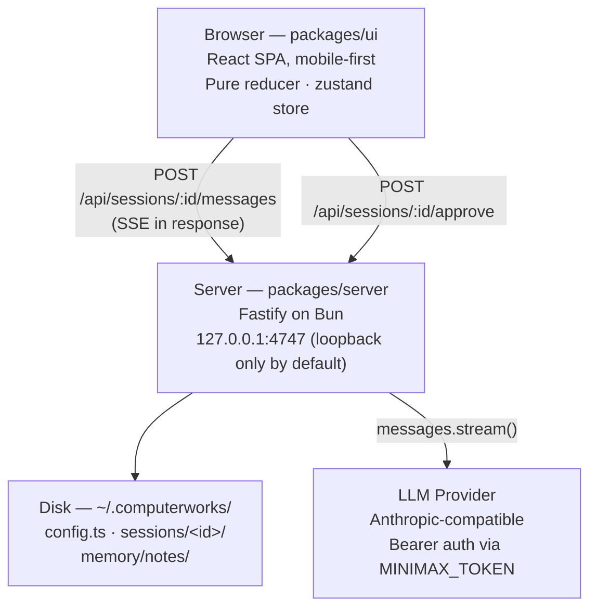
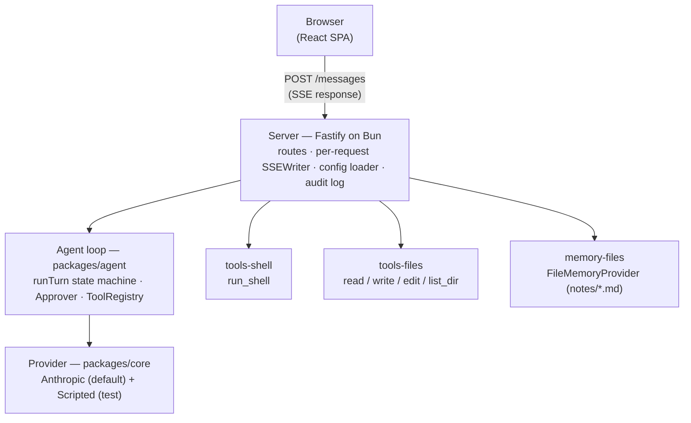
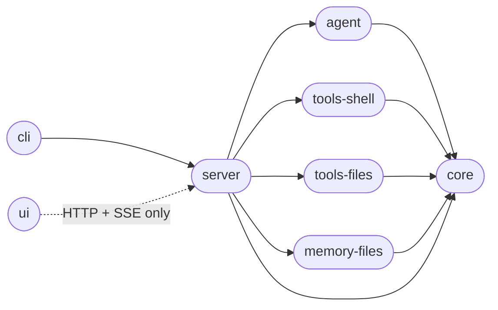

# ComputerWorks — Architecture

> Local, single-user PC-control chatbot. Single-user, single-machine,
> loopback-only by default. The system is small by design: one Bun
> workspace, one Fastify server, one React SPA, one disk directory for
> user data.

This is the **one constant** architecture doc. It sketches the system
so a new agent can orient in a couple of minutes. Phase-by-phase design
notes live in [`docs/specs/`](specs/).

## Runtime topology

One user, one server, one UI, one disk. The only outbound network call
is to the LLM provider. ComputerWorks is intentionally loopback-bound
unless you pass `--allow-non-loopback`.



## Server-internal architecture

Inside the Fastify server, the request lifecycle is linear: a `POST
/messages` hijacks the reply into a per-response `SSEWriter`, runs the
agent loop, writes each `AgentEvent` as an SSE frame, and closes the
response with a terminal `done` frame. There is no broadcast manager
— every request owns its own stream.



## Wire protocol — one turn end-to-end

Post-Phase 14, **one HTTP request carries the whole turn**. The POST
that delivers the user message is also the SSE response the UI reads.
There is no separate `GET /stream` route, no broadcast manager, no
shared fanout.

```mermaid
sequenceDiagram
    participant UI as Browser (UI)
    participant Srv as Server
    participant Loop as Agent loop
    participant Tool as Tool registry
    participant LLM as LLM Provider

    UI->>Srv: POST /api/sessions/:id/messages {content}
    Srv-->>UI: 200 text/event-stream
    Srv->>Loop: runTurn(provider, history, tools, approver, signal)

    loop while turn not done
      Loop->>LLM: provider.chat({model, system, messages, tools})
      LLM-->>Loop: StreamEvent (token / tool_call / message_done)
      Loop-->>Srv: AgentEvent (token / tool_call)
      Ssr-->>UI: SSE frame: token / tool_call

      alt tool_call requires approval
        Loop->>Srv: approver.request(req)
        Srv-->>UI: SSE frame: approval_required
        UI->>Srv: POST /api/sessions/:id/approve {requestId, decision}
        Srv->>Loop: resolve(requestId, decision)
      end

      Loop->>Tool: registry.execute(name, input, ctx)
      Tool-->>Loop: {result, is_error}
      Loop-->>Srv: AgentEvent (tool_result)
      Srv-->>UI: SSE frame: tool_result
    end

    Loop-->>Srv: AgentEvent (done)
    Srv-->>UI: SSE frame: done + close
```

## Tech stack

| Concern             | Choice                                                |
| ------------------- | ----------------------------------------------------- |
| Runtime + pkg mgr   | **Bun** (workspaces, native TS, `bun test`)           |
| Language            | TypeScript (strict, ESM, `noUncheckedIndexedAccess`)  |
| Server framework    | **Fastify** on Bun                                    |
| LLM SDK             | `@anthropic-ai/sdk` (Messages API)                    |
| UI framework        | **React + Vite + TypeScript** (SPA, mobile-first)     |
| Markdown rendering  | `react-markdown` + `remark-gfm` + `rehype-sanitize` + `shiki` |
| State (UI)          | `zustand`                                             |
| Validation          | `zod`                                                 |
| Config loader       | `jiti` (TS config at runtime)                         |
| Tests               | `bun test`                                            |

## Monorepo layout

```
computerworks/
├── package.json           # private workspace, scripts: dev / build / test / typecheck / start
├── bunfig.toml            # bun config
├── tsconfig.base.json     # strict, ESM, bundler resolution
├── tsconfig.build.json    # project references for `tsc -b`
├── docs/
│   ├── architecture.md    # this file
│   └── specs/             # one folder per phase
├── packages/
│   ├── core/              # types + Provider interface + Anthropic + Scripted providers
│   ├── agent/             # runTurn state machine + Approver + ToolRegistry
│   ├── tools-shell/       # run_shell
│   ├── tools-files/       # read_file / write_file / edit_file / list_dir + path-safety
│   ├── memory-files/      # FileMemoryProvider (notes under ~/.computerworks/memory/notes/)
│   ├── server/            # Fastify app, per-message SSE, session store, routes, CLI
│   ├── cli/               # `computerworks` subcommands
│   └── ui/                # React + Vite SPA, zustand store, pure reducer
└── scripts/
    └── e2e.ts             # end-to-end smoke (excluded from `bun test`)
```

### Package dependency graph



The UI does **not** import `core`, `agent`, or any tool package. It talks
to the server over HTTP+SSE only. Wire-shape types are duplicated into
`packages/ui/src/api/types.ts` so the UI build stays independent of the
server packages.

## Persistence — `~/.computerworks/`

All user data lives under one directory. No database. Three subtrees:
the user-authored config, one folder per session with three files, and
the agent's memory notes.

```
~/.computerworks/
  config.ts                          # user-authored; jiti-loaded; zod-validated
  sessions/
    <session-id-a>/
      meta.json                      # {id, title, createdAt, updatedAt, cwd, model, allowlist}
      messages.jsonl                 # append-only transcript; one JSON Message per line
      audit.jsonl                    # append-only tool-call decisions
  memory/
    index.json                       # cached note listing; rebuilds from disk on first use
    notes/
      user-preferences.md
      project-<name>.md
```

Write rules: `messages.jsonl` and `audit.jsonl` use `fs.appendFile`
(kernel-guaranteed atomic on a single FD opened with `O_APPEND`), so
concurrent appends from multiple Bun tasks are safe. `meta.json` is
read whole + written via tmp + rename for atomicity; partial writes
can't corrupt it. There is no compaction step in v1 — files grow
append-only and a `computerworks compact` command is left for later.

## Boundaries and reserved seams

The system deliberately keeps three abstractions pluggable so future
phases can swap implementations without rewriting the agent loop:

| Interface         | v1 implementation              | Reserved for                          |
| ----------------- | ------------------------------ | ------------------------------------- |
| `Provider`        | Anthropic (default), Scripted  | OpenAI-compatible / Ollama / Gemini   |
| `MemoryProvider`  | File (`memory-files`)          | Vector backend                        |
| `Tool`            | Shell + file + memory tools    | MCP-compatible servers                |

## Where to look next

- **Phase-by-phase design notes** — `docs/specs/phase-NN-<name>/design.md`
- **Phase-by-phase requirements** — `docs/specs/phase-NN-<name>/requirements.md`
- **Active task ledger** — `TASKS.MD` at the repo root
- **Project standing rules** — `CLAUDE.md` at the repo root
- **User-facing manual** — `README.md` at the repo root
- **Human-driven UI smoke checklist** — `docs/specs/phase-08-e2e-verification/ui-smoke.md`

## Phase history (one-liner each)

The build is complete. Each phase landed as a sequence of commits on
`main`. The detailed task ledger is in `TASKS.MD`; the per-phase spec
folders hold the design notes and requirements for the work that landed.

- **Phase 0–2** — scaffolding, types, provider, agent loop.
- **Phase 3–4** — tools (`run_shell`, four file tools, file-based memory).
- **Phase 5–6** — server, config loader, session store, Fastify app,
  routes, CLI.
- **Phase 7** — UI: Vite + React, zustand store, three-pane layout, SSE
  consumer, markdown rendering, approval card.
- **Phase 8** — E2E smoke + UI checklist + README.
- **Phase 9–10** — MiniMax auth fix (LAN deployment followup) +
  mobile-friendly UI pass.
- **Phase 11** — persist LLM responses to transcript (assistant text +
  tool_use + tool_result land in `messages.jsonl`).
- **Phase 12** — URL-routable sessions + LLM-generated titles
  (`?session=<id>`, fire-and-forget title gen after each turn).
- **Phase 14** — per-message SSE + UI rewrite. POST opens its own SSE
  response; `SSEManager` deleted; the UI reducer is a pure function;
  mobile-first CSS rewrite.
