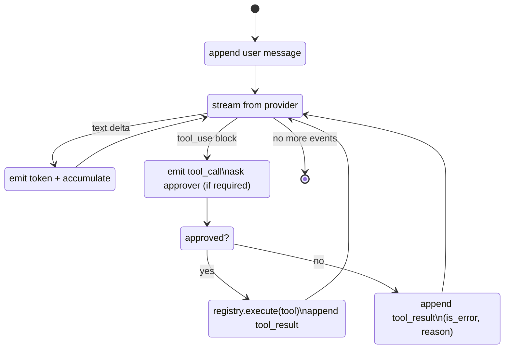

# Phase 2 — Design

## Module layout

```
packages/agent/src/
├── approval.ts           # Approver, ApprovalDecision, AutoApprover
├── approval.test.ts
├── registry.ts           # ToolRegistry + ToolValidationError
├── registry.test.ts
├── loop.ts               # runTurn(opts): Promise<Message>
└── loop.test.ts
```

## Agent loop signature

```ts
export type AgentEvent =
  | { type: 'token'; delta: string }
  | { type: 'tool_call'; call: ToolUseBlock }
  | { type: 'tool_result'; call_id: string; result: unknown;
      is_error: boolean; approved: boolean; tool: string }
  | { type: 'turn_done' }
  | { type: 'error'; message: string };

export interface AgentRunOptions {
  provider: Provider;
  model: string;
  system: string;
  history: Message[];
  tools: ToolDefinition[];
  approver: Approver;
  overrides?: ProviderOverrides;
  onEvent: (e: AgentEvent) => void;
  signal: AbortSignal;
  maxIterations?: number;     // default 25
}

export async function runTurn(opts: AgentRunOptions): Promise<Message>;
```

## State machine

One iteration = one `provider.chat()` call. The loop accumulates tokens
in `textAccum` but only acts on a single `tool_call`; multi-tool
responses are out of scope for the current loop.



## Loop guards

### Iteration cap

`maxIterations` defaults to 25 (configurable per call). If exceeded,
the loop emits an `error` event, appends a synthetic tool result
informing the model, and breaks out. The cap prevents an infinite
tool-call loop from holding a turn open indefinitely.

### Cancellation

`signal` (an `AbortSignal`) is threaded into:

- the `for await (const ev of provider.chat(...))` loop,
- the `approver.request(req, signal)` call (so an approval can be
  timed out), and
- every `registry.execute(name, input, ctx)` call via `ctx.signal`.

Cancellation throws `AbortError`. The partial assistant message is
**not** appended to history — the invariant is "if the user
cancelled, the cancelled message leaves no orphan".

### Provider errors

Surfaced as `AgentEvent.error`. The partial assistant message is not
appended; the user can retry. The on-disk transcript (after
[[phase-11-persist-responses|Phase 11]]) does include the partial
text so the SSE consumer's view is preserved.

### Tool errors

Caught at the registry boundary. Appended to history as
`tool_result` with `is_error: true` so the model can self-correct
on the next iteration.

## Approval model

```ts
export interface ApprovalRequest {
  call: ToolUseBlock;
  description: string;          // human-readable summary
  diff?: string;                // for write/edit_file
}

export type ApprovalDecision =
  | { kind: 'approve_once' }
  | { kind: 'approve_for_session'; pattern: string }
  | { kind: 'reject'; reason: string }
  | { kind: 'edit'; newInput: unknown };

export interface Approver {
  request(req: ApprovalRequest, signal: AbortSignal): Promise<ApprovalDecision>;
}
```

### `AutoApprover`

`AutoApprover(policy)` takes a sync-or-async policy function and
resolves the decision immediately. Used by unit tests and the E2E
smoke.

## Tool registry

```ts
export class ToolRegistry {
  register(tool: ToolDefinition): void;
  get(name: string): ToolDefinition | undefined;
  list(): ToolDefinition[];
  execute(name: string, input: unknown, ctx: ToolContext): Promise<unknown>;
}
```

`execute` validates `input` against the tool's zod schema. A failed
validation throws a typed `ToolValidationError` (not a raw
`ZodError`); the loop catches this specifically and emits a separate
`tool_validation_error` event so the UI can show "model called
`read_file` with bad args" inline instead of dumping JSON to the
model.

## Testing strategy

- `loop.test.ts` covers happy path, rejection recovery, iteration
  cap, cancellation, provider error, tool error, validation error.
- `registry.test.ts` covers validation success, validation failure,
  unknown tool, execute context wiring.
- `approval.test.ts` covers `AutoApprover` policy sync/async,
  `AbortSignal` rejection.

## Risks & mitigations

| Risk                                       | Mitigation                                                                  |
| ------------------------------------------ | --------------------------------------------------------------------------- |
| Infinite tool-call loops                   | Hard iteration cap (`maxIterations`, default 25) with synthetic error tool result. |
| Approver hangs forever                     | Default 5-minute timeout (Phase 5 wires this in `InteractiveApprover`); the signal aborts the wait. |
| Partial state on cancel                    | Invariant: cancelled message leaves no orphan. Loop does not append the partial on `AbortError`. |
