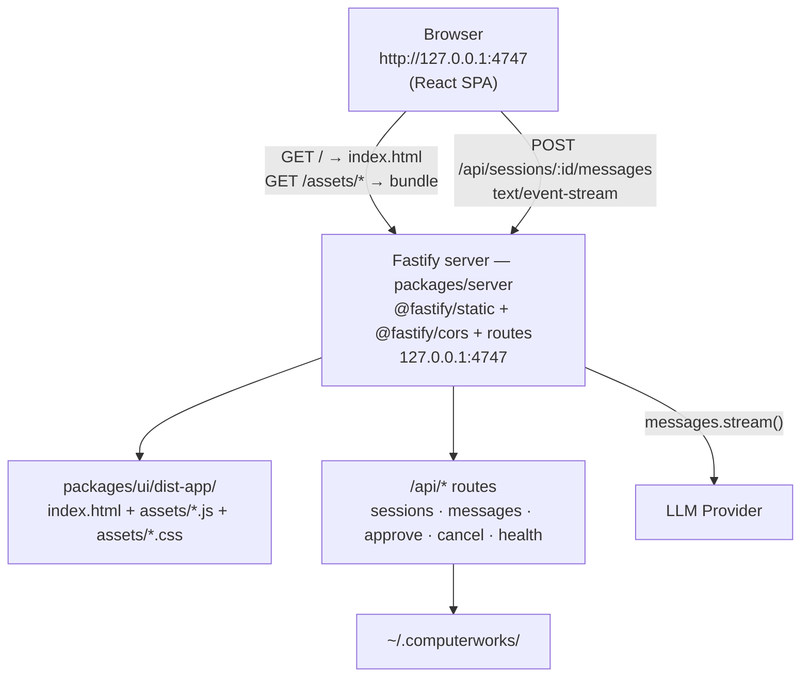

# Phase 15 — Design

## Architecture after this phase



The browser fetches HTML, JS, and CSS from `/` and `/assets/*` on
the same origin as the API. No CORS preflight, no proxy, no second
process.

## Server-side wiring

### `buildApp` change

`packages/server/src/app.ts`:

```ts
export interface BuildAppOptions {
  config: Config;
  store?: SessionStore;
  registry?: SessionRegistry;
  createProvider?: RunAgentDeps["createProvider"];
  autoApprove?: boolean;
  /**
   * Absolute path to the built UI bundle directory (typically
   * `packages/ui/dist-app`). When set, `@fastify/static` serves the
   * bundle at `/`, and a GET `/` fallback returns `index.html`.
   * Omit for API-only deployments or tests that don't care about
   * the UI.
   */
  uiRoot?: string;
}
```

If `opts.uiRoot` is set, `buildApp` registers `@fastify/static`
with `serve: false` (so it doesn't auto-register any routes) and
declares two routes explicitly:

- `GET /` → `reply.sendFile("index.html")`
- `GET /*` → `reply.sendFile(req.url.replace(/^\/+/, ""))`

The `serve: false` choice is deliberate: `@fastify/static` would
otherwise auto-register a `GET /` (and `GET /*` if `wildcard: true`)
that conflicts with our explicit handlers.

### `start.ts` change

`packages/server/src/start.ts`:

- Adds `--ui-root=<path>` CLI flag.
- Computes the default as `<this file's dir>/../../../packages/ui/dist-app`
  via `import.meta.dir`, so the value is correct regardless of cwd.
- Validates the resolved path exists with `existsSync`; fails fast
  with `Run \`bun run build\` first.` if not.

### `__cw` test handle

`__cw.uiRoot` is exposed for tests that want to assert the
configured root.

## Build pipeline

### UI package

`packages/ui/package.json`:

```json
"scripts": {
  "build": "tsc -b && vite build",
  "typecheck": "tsc -b --noEmit"
}
```

No more `dev` or `start` scripts — those were Vite dev-server
aliases for the now-defunct two-process workflow.

### Vite config

`packages/ui/vite.config.ts`:

```ts
export default defineConfig({
  plugins: [react()],
  resolve: {
    alias: {
      "@computerworks/core": resolve(__dirname, "../core/src/index.ts"),
      "@computerworks/agent": resolve(__dirname, "../agent/src/index.ts"),
    },
  },
  build: {
    outDir: "dist-app",
    emptyOutDir: true,
    sourcemap: true,
  },
});
```

No `server` block. `emptyOutDir: true` clears stale assets on every
build. Path aliases preserved so the bundle resolves the workspace
packages.

### Root scripts

`package.json`:

| Script          | Command                                                                                  |
| --------------- | ---------------------------------------------------------------------------------------- |
| `build`         | `tsc -b tsconfig.build.json && bun run --filter @computerworks/ui build`                  |
| `dev`           | `bun run build && bun run start`                                                          |
| `dev:watch`     | `bun run --filter @computerworks/ui build -- --watch & bun --env-file=.env run --filter @computerworks/server start:dev` |
| `start`         | `bun --env-file=.env run --filter @computerworks/server start`                           |
| `build:clean`   | `rm -rf packages/*/dist packages/ui/dist-app && bun run build`                            |

`dev:watch` runs `vite build --watch` and `bun --watch` in
parallel. UI changes trigger a rebuild and require a browser
refresh; server changes trigger a restart. There is no HMR (Vite
is build-only in this mode).

## CORS

CORS is unchanged. The allowlist still covers loopback and private
LAN ranges. With the UI on the same origin, browsers don't fire
preflight requests for the API — but external clients (CLI, curl,
other apps on loopback) still benefit from the allowlist.

The `localhost:5173` reference in the existing CORS test was
retargeted to `127.0.0.1:4747` to reflect the new origin.

## Testing strategy

- **`app.test.ts` — `describe("static UI (T15.1)")`**: 5 new tests
  using a temp dir as `uiRoot`:
  - `GET /` returns `index.html` (`text/html`, body match)
  - `GET /assets/main.js` returns the bundle
  - `GET /api/health` still returns JSON (no path conflict)
  - Without `uiRoot`, `GET /` returns 404 (UI is opt-in)
  - `__cw.uiRoot` is exposed for assertion
- **CORS test retarget**: `localhost:5173` → `127.0.0.1:4747`.
- **E2E smoke (`scripts/e2e.ts`)**: unchanged; still boots the
  real server on an ephemeral port and exercises the wire protocol.
- **`ui-smoke.md`**: rewritten boot sequence for the new
  single-port flow.

## Smoke verification

```
bun --env-file=.env run --filter @computerworks/server start -- --port=4749

# GET /                  → 200 text/html, 397 bytes (index.html)
# GET /assets/index-*.js → 200, 461 KB (the bundle)
# GET /api/health        → 200, {"ok":true}
```

## Risks & mitigations

| Risk                                       | Mitigation                                                                  |
| ------------------------------------------ | --------------------------------------------------------------------------- |
| User runs `bun run start` without building | `start.ts` validates `uiRoot` exists; fails fast with a clear error.        |
| `dist-app/` polluted by stale assets       | `vite.config.ts` sets `emptyOutDir: true`.                                  |
| Path resolution breaks under `--filter`    | `start.ts` uses `import.meta.dir`, not `process.cwd()`.                     |
| `@fastify/static` auto-registers a `GET /`  | `serve: false` keeps the plugin from registering any routes; we declare our own. |
| No HMR makes UI iteration slow             | `dev:watch` runs both watchers in parallel; refresh the browser after a UI change. |
| CORS origin mismatch in tests              | Test origin updated to `127.0.0.1:4747`.                                    |