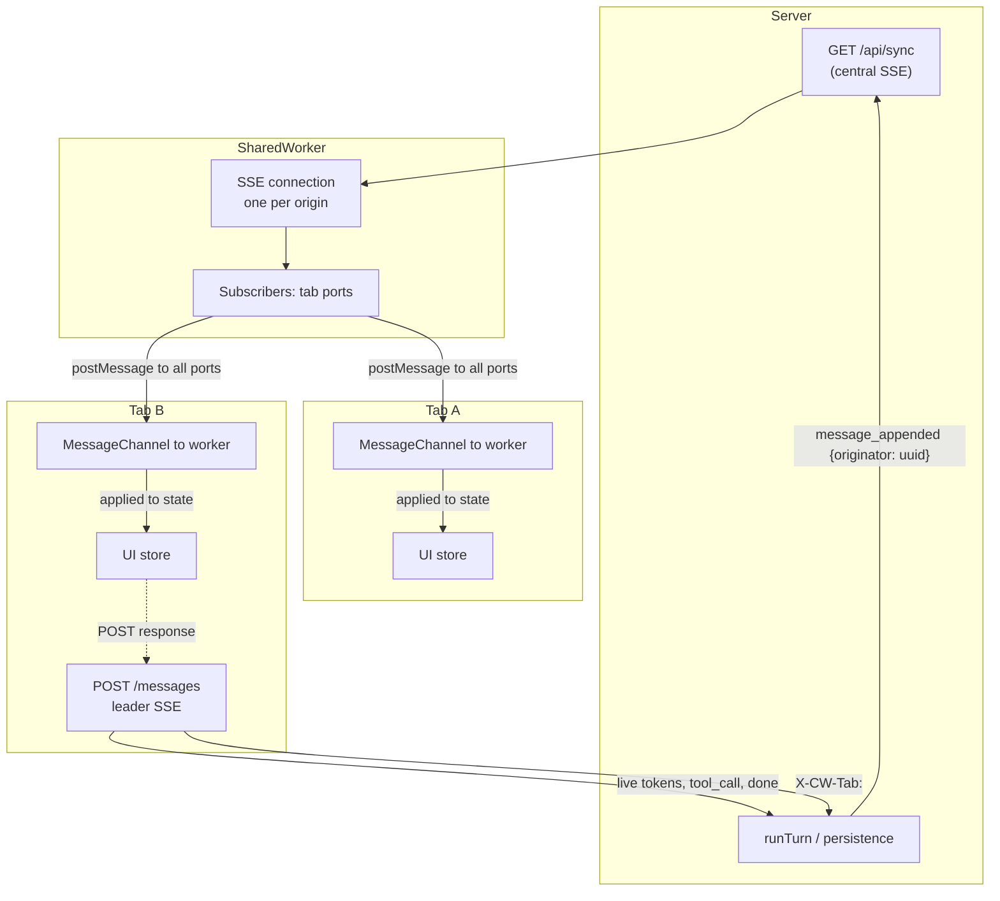

# Phase 17 — Design

## Architecture



## Event vocabulary split

| Stream | Event types carried |
| --- | --- |
| Per-message SSE (POST response, leader only — unchanged from Phase 14) | `message_start`, `token`, `tool_call`, `done` |
| Central SSE (everyone, via SharedWorker) | `message_appended`, `session_renamed`, `session_meta_updated`, `approval_required`, `tool_result`, `message_done`, `error` |

Disjoint at the wire level — the leader never sees the same event
twice. Idempotency on the reducer side covers any future cross-stream
regression (filter operations are no-ops on missing data; map
operations are idempotent).

## Wire shape

`ServerEvent` adds one variant:

```ts
| {
    type: "message_appended";
    sessionId: string;
    message: UiMessage;          // role + content + parts (server-side shape)
    originator: string;          // X-CW-Tab UUID of the originating tab
    ts: string;                  // ISO-8601
  }
```

POST header: `X-CW-Tab: <uuid>`. Falls back to `"anonymous"` if
missing.

## Server changes

### New: `SyncHub`

`packages/server/src/sync-hub.ts`.

```ts
export class SyncHub {
  private readonly subs = new Set<SSEWriter>();
  subscribe(writer: SSEWriter): () => void;
  unsubscribe(writer: SSEWriter): void;
  broadcast(event: ServerEvent): void;
  subscriberCount(): number;
}
```

A `Set`, not a `Map<sessionId, Set<writer>>` — the central SSE
carries all-session events; subscribers filter client-side.
Dead writers are removed from the set lazily (on next failed write).

### New: `GET /api/sync` route

`packages/server/src/routes/sync.ts`.

- Handler opens an `SSEWriter`, registers it with `SyncHub`,
  and keeps the connection open.
- On `req.raw.on("close")`, unregister.
- No data is sent initially — the broadcast events drive all
  traffic.

### Modified: messages route (`routes/messages.ts`)

- Read `X-CW-Tab` from request headers; fall back to `"anonymous"`.
- Stash `originator` on the `SessionRuntime` (the `InteractiveApprover`
  doesn't need it; the messages route writes `message_appended` events
  using it directly).
- After each `appendMessage` (user message at POST arrival,
  assistant message after turn), broadcast:
  ```ts
  syncHub.broadcast({
    type: "message_appended",
    sessionId,
    message: msg,
    originator,
    ts: new Date().toISOString(),
  });
  ```
- `InteractiveApprover` is constructed with the `SyncHub` instead
  of the per-request `SSEWriter`.

### Modified: `InteractiveApprover`

Constructor signature changes:

```ts
constructor(
  syncHub: SyncHub,
  sessionId: string,
  sessionAllowlist: readonly string[],
  globalShellAllowlist: readonly RegExp[],
  opts?: { timeoutMs?: number },
)
```

`approval_required` and `tool_result` events are written via
`syncHub.broadcast(sessionId, ev)`. The per-request writer is no
longer held by the approver.

### Modified: `app.ts`

- Instantiate `SyncHub` once.
- Pass it to `registerMessagesRoute` and `registerSyncRoute`.

## UI changes

### New: `SharedWorker` (`packages/ui/src/workers/sync.worker.ts`)

```ts
// Module-level state
const tabPorts = new Map<MessagePort, string>();
let sseAbort: AbortController | null = null;

self.addEventListener("connect", (ev: MessageEvent) => {
  const port = ev.ports[0];
  const tabId = crypto.randomUUID();
  tabPorts.set(port, tabId);
  port.postMessage({ kind: "registered", tabId });
  startSSEIfNeeded();   // idempotent; one SSE per worker
  port.addEventListener("message", () => {
    // tabs currently don't send messages; reserved for future
    // worker-mediated actions
  });
  port.start();
});

async function startSSEIfNeeded() {
  if (sseAbort) return;  // already running
  let attempt = 0;
  while (attempt < 5) {
    sseAbort = new AbortController();
    try {
      const res = await fetch("/api/sync", { signal: sseAbort.signal });
      // ... drainFrames + parseSSEFrame per existing stream.ts pattern
      for each event: broadcast to all tabPorts
      attempt = 0;  // reset on clean disconnect
    } catch (err) {
      if (err.name === "AbortError") break;
      attempt++;
      await sleep(Math.min(30_000, 1000 * 2 ** attempt));
    } finally {
      // tell tabs to resync
      for (const port of tabPorts.keys()) {
        port.postMessage({ kind: "resync" });
      }
      sseAbort = null;
    }
  }
}
```

The worker is the sole subscriber to the central SSE. Tabs talk
to it via `MessageChannel`, not via the SSE directly.

### New: `sync-client.ts`

```ts
export function connectSyncWorker(): {
  tabId: Promise<string>;
  onEvent(cb: (ev: ServerEvent) => void): () => void;
  onResync(cb: () => void): () => void;
};
```

Uses a `MessageChannel`. The "client" port is `worker.postMessage`-ed
the worker. The "server" port is held by the tab and receives
`postMessage({ kind: 'event' | 'registered' | 'resync' })` calls.

### Modified: `packages/ui/src/store/sessions.ts`

- New action `initSync()`: calls `connectSyncWorker`, awaits
  `tabId`, registers the event + resync listeners, dispatches
  events to `applyServerEvent(sessionIdFor(ev), ev)`.
- `sendMessage` reads the current `tabId` and passes it through to
  `sendMessageStreaming` as `originator`.

### Modified: `packages/ui/src/store/stream.ts`

`sendMessageStreaming` accepts `originator?: string` and adds it as
`X-CW-Tab` header.

### Modified: `packages/ui/src/store/reducer.ts`

- New `message_appended` branch (with originator + id dedupe).
- New `state.tabId: string | null` field.

### Modified: `packages/ui/src/App.tsx`

- Boot wiring: call `initSync()` once on mount.
- The listener survives session switches.

## Module layout (new + changed)

### New
- `packages/server/src/sync-hub.ts`
- `packages/server/src/sync-hub.test.ts`
- `packages/server/src/routes/sync.ts`
- `packages/server/src/routes/sync.test.ts`
- `packages/ui/src/workers/sync.worker.ts`
- `packages/ui/src/workers/sync-client.ts`
- `packages/ui/src/workers/sync.worker.test.ts`

### Modified
- `packages/server/src/sse.ts` (add `message_appended` to `ServerEvent`)
- `packages/server/src/app.ts` (instantiate `SyncHub`)
- `packages/server/src/interactive-approver.ts` (write to `SyncHub`)
- `packages/server/src/routes/messages.ts` (`X-CW-Tab`, broadcast
  `message_appended` after each `appendMessage`)
- `packages/server/src/routes/messages.test.ts`
- `packages/ui/src/api/types.ts` (`message_appended`, `tabId` field)
- `packages/ui/src/store/sessions.ts` (`initSync`)
- `packages/ui/src/store/sessions.test.ts`
- `packages/ui/src/store/reducer.ts` (`message_appended`)
- `packages/ui/src/store/reducer.test.ts`
- `packages/ui/src/store/stream.ts` (`originator` param)
- `packages/ui/src/App.tsx` (mount `initSync`)

## Testing strategy

- **Unit**: `SyncHub` (subscribe/unsubscribe/broadcast/dead-writer
  pruning). `interactive-approver` writes to hub. Reducer
  `message_appended` branches.
- **Integration**: `routes/sync.test.ts` — open connection,
  receive a broadcast, close. `messages.test.ts` — verify
  `message_appended` is broadcast after each `appendMessage`.
- **Worker**: `sync.worker.test.ts` (mocked fetch + ports) —
  connects on first port, assigns UUIDs, distributes events,
  reconnect logic.

## Risks & mitigations

See `requirements.md` for the full list. Highlights:

- **Worker reconnect misses events** — handled by tab-side
  `loadTranscript` + `loadSessions` on every `{ kind: 'resync' }`.
  Brief flicker (~10ms) is the trade-off. V2 path (server-side
  cursor replay) documented as future work.
- **No SharedWorker support** — fallback to per-tab direct
  connection to `GET /api/sync`.
- **Two tabs POSTing simultaneously** — server 409 to the loser
  (existing Phase 14); loser's optimistic message is removed with
  an error banner.