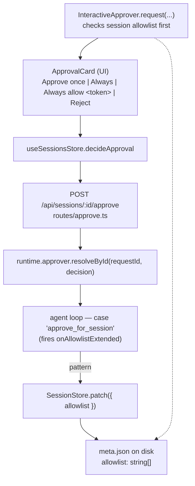

# Phase 18 — Pattern-based command approval: Design

## Architecture overview

This phase is a wire-up of half-built infrastructure, plus one small
new UI affordance. No new modules, no new dependencies, no wire-format
additions.



Two paths intersect:

- **Live path:** the next `run_shell` call after a pattern has been
  added matches it in `InteractiveApprover.matchesSessionAllowlist`
  and auto-approves without UI.
- **Decision path:** when the user clicks "Always", the agent loop
  fires `onAllowlistExtended(sessionId, pattern)`, which the messages
  route uses to call `SessionStore.patch({ allowlist: [...current, pattern] })`.

## Tech stack

Unchanged. Bun + TypeScript (server, agent), React + Vite (UI), Zod
(session-store schemas). No new deps.

## Module / package layout

Edits only — no new packages, no new files.

### Server (`packages/server/src/`)
- `interactive-approver.ts` — extend `matchesSessionAllowlist` to
  parse the pattern grammar and run regex matching; replace the
  current `pattern === call.name` only.
- `interactive-approver.test.ts` — add coverage for the parser +
  matcher (tool-name form, single-field form, multi-field form,
  invalid regex, mismatch).
- `routes/messages.ts` — read `meta.allowlist` and pass it into the
  `InteractiveApprover` constructor (today it passes `[]`); wire
  `onAllowlistExtended` so the loop's `approve_for_session` decision
  patches the session store.
- `routes/messages.test.ts` — integration test: send a message that
  triggers two tool calls with the same `curl` token, approve the
  first via "Always allow `curl …`", assert the second auto-approves
  and the audit log has the matching `pattern`.

### Agent (`packages/agent/src/`)
- `loop.ts` — when an `approve_for_session` decision lands, call the
  new `opts.onAllowlistExtended(sessionId, pattern)` callback (if
  provided). The existing `case "approve_for_session": approved = true`
  body is preserved; the callback is a side effect, not a return.

### UI (`packages/ui/src/`)
- `components/ApprovalCard.tsx` — render the existing three buttons
  (Approve once / Always / Reject). In addition: when the pending
  approval is for `run_shell` with a string `cmd` whose first token
  passes the safe-token regex, render a fourth button "Always allow
  `<token> …`". No "approve anything" button in V1 — that is
  reserved for a future YOLO-mode phase.
- `api/types.ts` — `SessionMeta.allowlist` is already optional;
  extend it to `allowlist?: string[]` (no shape change).
- `store/sessions.ts` — `decideApproval` already accepts the existing
  decision discriminated union; pass `pattern` through unchanged. The
  fourth-button click handler emits
  `pattern: "run_shell:cmd=/^<escapeRegex(token)>(\s|\"|$)/"`.

## Data model

### Pattern grammar (in code)

```
Pattern {
  toolName: string                 // "run_shell"
  clause: { field: string; regex: RegExp } | null  // null for tool-name-only form
}
```

Parse function signature:

```typescript
function parsePattern(raw: string): Pattern | null
```

Algorithm:

1. `colon = raw.indexOf(":")`.
2. `toolName = colon === -1 ? raw : raw.slice(0, colon)`.
3. Validate toolName matches `^[a-z][a-z0-9_-]*$`. If validation
   fails, return `null` (catches empty input, uppercase, and any
   stray characters — including the reserved `*` which is reserved
   for a future "YOLO mode" phase; today `parsePattern("*")` returns
   `null` and the route returns 400).
4. If `colon === -1`: tool-name-only form. Return
   `{ toolName, clause: null }`.
5. Otherwise (`colon !== -1`): `body = raw.slice(colon + 1)`.
   Body must contain `=`. `field` is everything before the first
   `=`; `regexSource` is everything after. Compile `regexSource`
   with `new RegExp(regexSource)` inside try/catch — return `null`
   on throw or if the regex source is longer than 256 characters.
   Validate field matches `^[a-z][a-z0-9_]*$` (return `null`
   otherwise). Empty body (trailing `:` with nothing after) is
   rejected.

`parsePattern` returns `null` on any failure — the route treats `null`
as HTTP 400.

### `SessionMeta.allowlist`

No schema change. Already declared as
`z.array(z.string()).default([])` since T5.2. New entries are appended
in insertion order; matches iterate in order and stop at first hit.

### `AuditEntry`

Add an optional `pattern?: string` field. Populated only when
`decision === "auto_approve"` and a session allowlist pattern was the
matcher. The zod schema adds:

```typescript
pattern: z.string().optional(),
```

…which is forward-compatible — old audit lines remain valid.

## API surface

### `POST /api/sessions/:id/approve`

No route change. The `Body` zod already accepts
`{ kind: "approve_for_session", pattern: string }`. We additionally
reject (400) if `parsePattern(decision.pattern)` returns `null` —
this prevents a malicious client from inserting a regex that crashes
the server.

### `interactive-approver.ts`

Constructor signature changes from
`(leaderWriter, syncHub, sessionId, sessionAllowlist, globalShellAllowlist, opts)`
to the same — but the second-to-last parameter is now treated as a
list of pattern strings, parsed once at construction time:

```typescript
constructor(
  leaderWriter: SSEWriter,
  syncHub: SyncHub,
  sessionId: string,
  sessionPatterns: readonly string[],   // ← parsed into Pattern[] here
  globalShellAllowlist: readonly RegExp[],
  opts?: InteractiveApproverOptions,
)
```

Parsing is done eagerly so a malformed pattern surfaces at
construction time (route returns 400 on `buildApp`), not at the first
matching call.

### `agent.runTurn` options

Add an optional callback:

```typescript
interface AgentRunOptions {
  // ...existing
  /** Called when the user clicks "Always" / "Always allow <token>".
   *  The messages route uses it to persist the new pattern to
   *  meta.json. Best-effort: errors are logged, never thrown. */
  onAllowlistExtended?: (sessionId: string, pattern: string) => void;
}
```

The agent package doesn't import `SessionStore` — keeping the
storage dependency at the route boundary.

## Key algorithms

### Pattern matching against a call

```typescript
matchesSessionAllowlist(call: { name: string; input: unknown }): boolean {
  if (this.sessionPatterns.length === 0) return false;
  const input = call.input;
  const inputObj = (input && typeof input === "object") ? input as Record<string, unknown> : {};
  return this.sessionPatterns.some((p) => {
    if (p.toolName !== call.name) return false;
    if (p.clause === null) return true; // tool-name-only pattern
    const v = inputObj[p.clause.field];
    return typeof v === "string" && p.clause.regex.test(v);
  });
}
```

A pattern's `toolName` must equal `call.name` for a match — there
is no wildcard toolName. (YOLO-mode wildcard is reserved for a
later phase; see requirements.md "Out of scope".)

`matchesGlobalShell` is unchanged.

### First-token derivation (UI)

```typescript
function firstToken(cmd: string): string | null {
  const m = cmd.trimStart().match(/^[^\s"']+/);
  if (!m) return null;
  const tok = m[0];
  if (!tok) return null;
  // Disallow shell metacharacters in the captured token; we want
  // plain command names like "curl" or "grep", not "rm" or "&&".
  if (!/^[A-Za-z][A-Za-z0-9._-]*$/.test(tok)) return null;
  return tok;
}
```

The pattern source returned to the server is:

```
run_shell:cmd=/^<escapeRegex(tok)>\b/
```

`escapeRegex` is the standard
`s.replace(/[.*+?^${}()|[\]\\]/g, "\\$&")`.

`\b` is a regex word boundary — the spot between a word character
(`[A-Za-z0-9_]`) and a non-word character (or start/end of string).
It cleanly expresses "the captured token ends here" and reads more
intuitively than an explicit alternation. For shell `cmd` strings
(where non-word characters are whitespace and shell punctuation)
`\b` matches the natural "end of the command token" spot.

### Append-and-dedupe

```typescript
async function extendAllowlist(
  store: SessionStore,
  sessionId: string,
  pattern: string,
): Promise<void> {
  const current = await store.get(sessionId);
  if (!current) return;
  if (current.allowlist.includes(pattern)) return;
  await store.patch(sessionId, {
    allowlist: [...current.allowlist, pattern],
  });
}
```

Read-modify-write is acceptable here: `PATCH /api/sessions/:id` is
already serial via the tmp-file + rename, and the only writer of
`allowlist` is the in-flight turn. We don't need a CAS loop.

## State management

No new state. The approver instance holds the parsed patterns in
memory for the duration of one turn. The persistent state is the
session's `meta.allowlist`. Cross-turn, the messages route reads
`meta.allowlist` again on the next `POST /messages`, so a fresh
approver instance sees the latest list.

## Error handling

- Malformed pattern in HTTP body → 400, body `{ error: "invalid pattern: <reason>" }`.
- Malformed pattern stored on disk → the approver constructor throws
  on startup; the route returns 500 with a clear message. (We accept
  this — meta.json is user-editable but not user-edited under normal
  flow.)
- `store.patch` failure during `onAllowlistExtended` → log + swallow.
  The current call still approves. The next call may re-prompt; the
  user can click "Always" again. (Surfacing the failure to the UI is
  out of scope for V1.)
- Regex execution throwing mid-match → treat as no-match (defensive,
  not expected from UI-generated patterns).

## Testing strategy

Per CLAUDE.md §2, integration tests first. Tests added:

### Server unit (`interactive-approver.test.ts`)
- `parsePattern` round-trips: tool-name-only, single-clause with a
  regex that contains `=` inside (e.g. `cmd=/a=b/`), invalid
  regex source, `>256` char regex source, `parsePattern("*")`
  returning `null` (wildcard reserved for YOLO-mode phase; see
  requirements.md out-of-scope). Multi-clause (comma-separated
  AND) is **not** supported in V1 and any pattern with a `,` in
  the body is parsed as a single clause (the comma becomes part
  of the regex source).
- `matchesSessionAllowlist` matches on tool-name form.
- `matchesSessionAllowlist` matches on `cmd` regex (curl example).
- `matchesSessionAllowlist` does NOT match when field is missing.
- `matchesSessionAllowlist` does NOT match when field is non-string.
- `matchesSessionAllowlist` does NOT match a different tool name.
- `matchesSessionAllowlist` iterates the list and stops at first hit.
- Auto-approve emits `tool_result(approved: true, reason: "matched
  pattern <pattern>")`.

### Server integration (`routes/messages.test.ts`)
- Approving the first `run_shell` call with "Always allow `curl …`"
  causes the next `run_shell` call with a different `curl` to
  auto-approve.
- `audit.jsonl` for the auto-approved call has
  `decision: "auto_approve"`, `pattern: <matched-pattern>`.

### Agent unit (`loop.test.ts`)
- `runTurn` calls `onAllowlistExtended(sessionId, pattern)` exactly
  once per `approve_for_session` decision.
- Missing `onAllowlistExtended` is a no-op (no throw).

### UI (`ApprovalCard.test.tsx` or store action tests)
- For `run_shell{cmd: "curl -s X"}`, the rendered card has the
  derived button labelled "Always allow `curl …`".
- For `read_file{path: "/x"}`, the derived button is absent.
- For `run_shell{cmd: ""}` or non-string `cmd`, the derived button is
  absent.
- Clicking the derived button emits
  `decide({ kind: "approve_for_session", pattern: "run_shell:cmd=/^curl\\b/" })`
  (note: `\b` is double-escaped in the JS string literal; on the
  wire it's the four characters `\b`).
- No "Approve anything" button is rendered (reserved for a future
  YOLO-mode phase; see requirements.md out-of-scope).

## Deployment / runtime

No changes. Same Fastify server, same single-port build, same UI
bundle. The UI rebuild emits a slightly larger bundle (a few hundred
bytes for the derivation + regex literal), no asset graph changes.

## Security & privacy

- Pattern strings are user-controlled (they're whatever the UI sent,
  or a string the user typed into `meta.json` by hand). The server
  caps length at 256 chars and refuses malformed regexes at the
  HTTP boundary. No remote code execution vector — `new RegExp(s)`
  is sandboxed by the JS runtime.
- Patterns are stored in plain text on disk (`~/.computerworks/sessions/<id>/meta.json`).
  They may include the literal command name (e.g. `curl`). For a
  single-user, local-first tool this is fine — if the user is
  worried about local-disk exposure of command history, they
  already have that exposure in `messages.jsonl`.
- A malicious local user editing `meta.json` to inject a malicious
  regex can DoS their own agent loop (catastrophic backtracking) but
  can't escape the process. Acceptable.

## Risks & mitigations

| Risk | Mitigation |
|---|---|
| First-token heuristic picks the wrong command for unusual shells (`sudo`, `command -v`, etc.) | User falls back to "Approve once" or the broader "Always allow `run_shell`" path. Heuristic is intentionally narrow. |
| User clicks "Always allow `run_shell`" expecting per-command granularity | Button label is "Always allow `run_shell`" — explicit. The derived button says "Always allow `curl …`" so the granularity is visible. |
| Pattern append is racy across concurrent tabs (read-then-write) | Single in-flight turn per session → single writer. The store.patch tmp+rename serializes. Acceptable. |
| Pattern source stored verbatim, with metacharacters that look benign but match too much (e.g. `/.*/`) | Pattern is allowed if `parsePattern` accepts it. UI only generates first-token patterns. Server route rejects patterns > 256 chars. Trade-off: trust the UI for now. |
| Cross-tab sync of allowlist updates — does tab B see the new pattern? | Yes — `SessionStore.patch` triggers `session_meta_updated` via `SyncHub.broadcast` (already wired in Phase 17). All tabs see the new allowlist on the next `matchesSessionAllowlist` check. No additional work. |

## Implementation order

1. **Server: `parsePattern` + `InteractiveApprover.matchesSessionAllowlist`.** Unit tests for the grammar and matcher. ~150 lines.
2. **Server: wire `meta.allowlist` into the route, add `onAllowlistExtended` callback, fire it from the loop.** Integration test for end-to-end allow-once-then-auto-approve flow. ~80 lines + tests.
3. **Server: extend `AuditEntry` with `pattern`.** Update `messages.ts` to write `decision: "auto_approve"` + `pattern` for session-allowlist hits. Unit test. ~30 lines + tests.
4. **UI: derived button in `ApprovalCard`.** Unit tests for presence/absence by tool/input shape. ~40 lines + tests.
5. **Docs, smoke, ship.** Update `architecture.md` if needed (probably not — this is a sub-detail of an existing node), update `CLAUDE.md` "Phase status", close out T18.4.

Each step lands behind `bun run typecheck && bun test`.