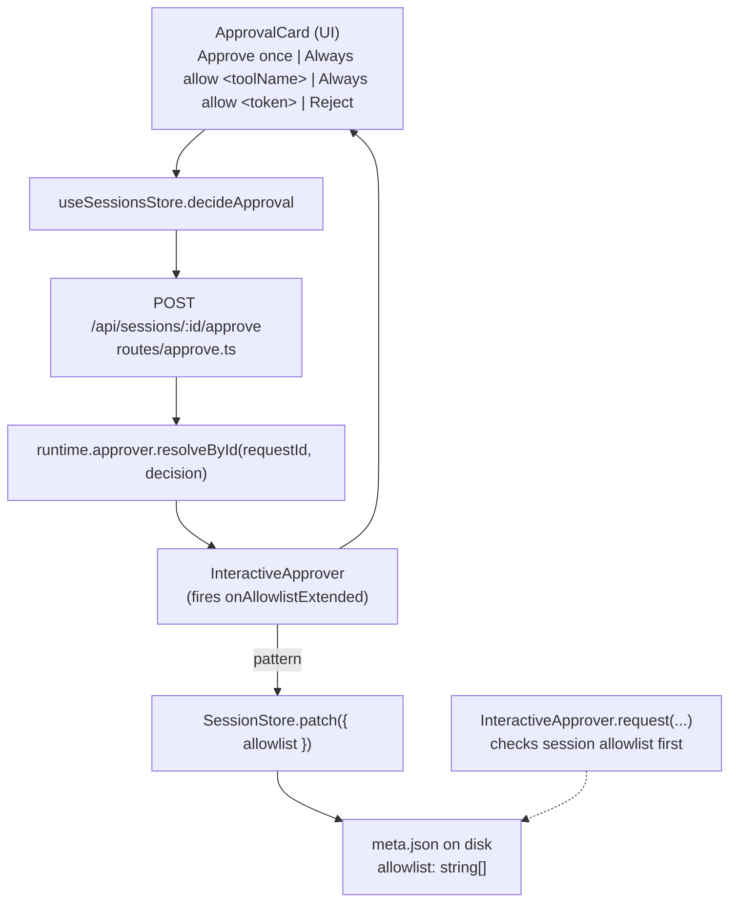

# Phase 18 — Pattern-based command approval: Design

## Architecture overview

This phase is a wire-up of half-built infrastructure, plus one small
new UI affordance. No new modules, no new dependencies, no changes to
the `agent` package.



Two paths intersect:

- **Live path:** the next `run_shell` call after a pattern has been
  added matches it in `InteractiveApprover.matchesSessionAllowlist`
  and auto-approves without UI.
- **Decision path:** when the user clicks "Always", the agent loop
  fires `onAllowlistExtended(sessionId, pattern)`, which the messages
  route uses to call `SessionStore.patch({ allowlist: [...current, pattern] })`.

## Tech stack

Unchanged. Bun + TypeScript (server, agent), React + Vite (UI), Zod
(session-store schemas). No new deps.

## Module / package layout

Edits only — no new packages. One new file:
`packages/ui/src/components/ApprovalCard.test.tsx`.

### Server (`packages/server/src/`)
- `interactive-approver.ts` — extend `matchesSessionAllowlist` to use
  the prefix grammar: tool-name equality OR first-token equality
  against `cmd` / `path` / `name` / any first string field. Add
  `parsePattern`, `formatPattern`, `firstToken`, `isCoveredByAllowlist`
  as exported helpers. Constructor eagerly parses the session
  allowlist so a malformed pattern throws at request entry, not at
  first match.
- `interactive-approver.test.ts` — cover `parsePattern` (tool form,
  prefix form, malformed), `firstToken`, `isCoveredByAllowlist`
  (tool form, prefix form, mismatch, fallback to `path`),
  `InteractiveApprover` auto-approve flow, and the
  `onAllowlistExtended` callback.
- `session-store.ts` — add an optional `pattern` field to
  `AuditEntry`. Forward-compatible — old audit lines remain valid.
- `routes/messages.ts` — read `meta.allowlist` from the store and
  pass it to the approver constructor (today it passes `[]`); wire
  `onAllowlistExtended` so the approver's
  `approve_for_session` flow patches the session store via
  `SessionStore.patch({ allowlist: [...current, pattern] })`. Also
  enrich each audit entry: stamp the tool name (was `"<unknown>"`
  pre-12.x) and the matched pattern when the session allowlist
  covers the call.
- `routes/messages.test.ts` — integration test: send two consecutive
  messages that each trigger a `run_shell` call with `echo …`. The
  first approves with
  `approve_for_session, pattern: "tool:run_shell echo"`. The second
  is auto-approved with no `approval_required` event; the audit
  log's second entry has `decision: "auto_approve"` and
  `pattern: "tool:run_shell echo"`.

### Agent (`packages/agent/src/`)
No changes. `onAllowlistExtended` lives inside `InteractiveApprover`,
so the agent package is untouched.

### UI (`packages/ui/src/`)
- `components/ApprovalCard.tsx` — render the existing three buttons
  (Approve once / Always / Reject). In addition: when the pending
  approval is for `run_shell` with a string `cmd` whose first token
  passes the safe-token check
  (`/^[A-Za-z][A-Za-z0-9._-]*$/`), render a fourth button
  "Always allow `<token> …`". Rename the existing "Always" label to
  "Always allow `<toolName>`". No "approve anything" button in V1
  — that is reserved for a future YOLO-mode phase.
- `components/ApprovalCard.test.tsx` (new) — presence/absence
  coverage: `run_shell{cmd:"curl -s X"}` shows the derived button,
  `read_file{path:"/x"}` doesn't, `run_shell{cmd:""}` doesn't,
  weird tokens don't.
- `api/types.ts` — `SessionMeta.allowlist` is already optional;
  no shape change.
- `store/sessions.ts` — `decideApproval` already accepts the
  existing decision discriminated union; pass `pattern` through
  unchanged. The fourth-button click handler emits
  `pattern: "tool:run_shell " + token`.

## Data model

### Pattern grammar (in code)

```typescript
type ParsedPattern =
  | { kind: "tool"; name: string }
  | { kind: "tool_prefix"; name: string; prefix: string };
```

Parse function signature:

```typescript
function parsePattern(input: string): ParsedPattern; // throws on malformed input
```

Algorithm:

1. Reject the empty string and any string containing `\n` or `\t`.
2. Require the input to start with `"tool:"`.
3. After `"tool:"`, look for the first ASCII space. There is at
   most one (no multi-clause AND in V1).
4. Everything before the space is the tool name (single token — no
   embedded whitespace). Everything after the space, if present,
   is the prefix (single token — no embedded whitespace).
5. Both tokens must be non-empty.

`parsePattern` **throws** on any failure. The `InteractiveApprover`
constructor wraps it in a try/catch: malformed entries in
`meta.allowlist` cause the approver construction to throw, and the
route surfaces a 500. (We treat `meta.json` as user-managed only in
the sense that the user can edit it by hand — the system does not
produce malformed patterns.)

`isCoveredByAllowlist(allowlist, toolName, input)` walks the list
and stops at the first hit. Each pattern is re-parsed in a try/catch
so a single malformed entry does not poison the rest of the
allowlist.

### `SessionMeta.allowlist`

No schema change. Already declared as
`z.array(z.string()).default([])` since T5.2. New entries are appended
in insertion order; matches iterate in order and stop at first hit.

### `AuditEntry`

Add an optional `pattern?: string` field. Populated only when
`decision === "auto_approve"` and a session allowlist pattern was the
matcher. The zod schema adds:

```typescript
pattern: z.string().optional(),
```

…which is forward-compatible — old audit lines remain valid.

## API surface

### `POST /api/sessions/:id/approve`

No route change. The `Body` zod already accepts
`{ kind: "approve_for_session", pattern: string }`. The
`InteractiveApprover.request(...)` callback validates the pattern
before persisting it: a malformed pattern is silently dropped (the
in-flight tool call still approves). The constructor is the only
place a `parsePattern` failure can throw on a request path.

### `interactive-approver.ts`

Constructor signature is unchanged:

```typescript
constructor(
  leaderWriter: SSEWriter,
  syncHub: SyncHub,
  sessionId: string,
  sessionAllowlist: readonly string[],   // ← parsed into ParsedPattern[] here
  globalShellAllowlist: readonly RegExp[],
  opts?: InteractiveApproverOptions,
)
```

The fourth parameter is now treated as a list of pattern strings
and parsed once at construction time. The `opts` bag gains a
`onAllowlistExtended(pattern)` callback that the approver fires
when an `approve_for_session` decision lands; the messages route
wires this to `SessionStore.patch`.

Parsing is eager so a malformed pattern in `meta.allowlist`
surfaces at request entry (the route returns 500 with a clear
message), not at the first matching call.

### `agent.runTurn`

No changes. The `agent` package is untouched by this phase.

## Key algorithms

### Pattern matching against a call

```typescript
matchesSessionAllowlist(toolName: string, input: Record<string, unknown>): boolean {
  if (this.parsedAllowlist.length === 0) return false;
  return this.parsedAllowlist.some((p) => matchesParsed(p, toolName, input));
}

function matchesParsed(
  p: ParsedPattern,
  toolName: string,
  input: Record<string, unknown>,
): boolean {
  if (p.kind === "tool") return p.name === toolName;
  if (p.name !== toolName) return false;
  const cmd = pickFirstStringField(input);
  if (cmd === null) return false;
  const tok = firstToken(cmd);
  if (tok === null) return false;
  return tok === p.prefix;
}

const TOOL_INPUT_STRING_FIELDS = ["cmd", "path", "name"] as const;
function pickFirstStringField(input: Record<string, unknown>): string | null {
  for (const k of TOOL_INPUT_STRING_FIELDS) {
    const v = input[k];
    if (typeof v === "string") return v;
  }
  for (const v of Object.values(input)) {
    if (typeof v === "string") return v;
  }
  return null;
}
```

A pattern's `name` must equal `toolName` for a match — there is no
wildcard name. The first-string-field fallback makes the prefix form
useful beyond `run_shell` (e.g. `tool:read_file /tmp/foo` matches
file reads against `/tmp/foo`), even though the V1 UI only
generates derived buttons for `run_shell`.

`matchesGlobalShell` is unchanged.

### First-token derivation (UI) and matching (server)

The same `firstToken` helper is used on both sides:

```typescript
function firstToken(s: string): string | null {
  const trimmed = s.trim();
  if (trimmed.length === 0) return null;
  for (let i = 0; i < trimmed.length; i++) {
    const c = trimmed.charCodeAt(i);
    if (c === 0x20 /* space */ || c === 0x09 /* tab */) {
      return trimmed.slice(0, i);
    }
  }
  return trimmed;
}
```

The UI uses `firstToken` to compute the captured token. The server
uses it to compute the same first token for matching. A pattern
`tool:run_shell curl` matches iff `firstToken(pickFirstStringField(input))
=== "curl"`. No regex evaluation, no string escape — straight string
equality.

The UI adds a safety filter before emitting the button: the token
must match `/^[A-Za-z][A-Za-z0-9._-]*$/` (i.e. it has to look like a
plain command name — `curl`, `git`, `node`, `python3`, etc.). A token
like `sudo` is allowed; `rm;echo x` is rejected; empty input is
rejected. This keeps the allowlist free of nonsense entries.

### Append-and-dedupe

```typescript
async function extendAllowlist(
  store: SessionStore,
  sessionId: string,
  pattern: string,
): Promise<void> {
  const current = await store.get(sessionId);
  if (!current) return;
  if (current.allowlist.includes(pattern)) return;
  await store.patch(sessionId, {
    allowlist: [...current.allowlist, pattern],
  });
}
```

Read-modify-write is acceptable here: `PATCH /api/sessions/:id` is
already serial via the tmp-file + rename, and the only writer of
`allowlist` is the in-flight turn. We don't need a CAS loop.

## State management

No new state. The approver instance holds the parsed patterns in
memory for the duration of one turn. The persistent state is the
session's `meta.allowlist`. Cross-turn, the messages route reads
`meta.allowlist` again on the next `POST /messages`, so a fresh
approver instance sees the latest list.

## Error handling

- Malformed pattern in HTTP body → the `onAllowlistExtended` callback
  re-validates with `parsePattern` and silently drops the pattern
  (the in-flight tool call still approves).
- Malformed pattern stored on disk → the approver constructor throws
  on the request path; the route returns 500 with a clear message.
  (We accept this — `meta.json` is user-editable but not user-edited
  under normal flow.)
- `store.patch` failure during `onAllowlistExtended` → log + swallow.
  The current call still approves. The next call may re-prompt; the
  user can click "Always" again. (Surfacing the failure to the UI is
  out of scope for V1.)

## Testing strategy

Per CLAUDE.md §2, integration tests first. Tests added:

### Server unit (`interactive-approver.test.ts`)
### Server unit (`interactive-approver.test.ts`)
- `parsePattern` round-trips with `formatPattern` (tool form,
  tool_prefix form).
- `parsePattern` rejects: empty string, missing `tool:` prefix,
  empty tool name, embedded newlines, embedded tabs, more than
  one whitespace-separated token after the name.
- `firstToken` returns the first whitespace-delimited token, trims
  leading whitespace, treats tabs as separators, returns `null`
  for empty / whitespace-only input.
- `isCoveredByAllowlist` matches a bare-tool pattern; matches a
  tool_prefix pattern against `cmd` first; does NOT match a
  different tool; does NOT match a different first token; returns
  false on empty allowlist; silently ignores malformed patterns;
  falls back to `path` for non-shell tools.
- `InteractiveApprover` auto-approves a `run_shell` call whose
  first token matches a tool_prefix pattern; auto-approves a
  `read_file` call whose tool form is allowlisted; fires
  `onAllowlistExtended` when `approve_for_session` lands.
- `onAllowlistExtended` is best-effort — a thrown callback does
  not crash the in-flight tool call.

### Server integration (`routes/messages.test.ts`)
- First `run_shell` call prompts the user; approving with
  `approve_for_session, pattern: "tool:run_shell echo"` persists
  the pattern to `meta.allowlist` (read back from disk after the
  in-flight turn completes).
- Second `run_shell` call on the same session is auto-approved
  (no `approval_required` event in the SSE stream).
- `audit.jsonl` for the auto-approved call has
  `decision: "auto_approve"`, `pattern: "tool:run_shell echo"`,
  `tool: "run_shell"`.

### Agent unit
None. The agent package is unchanged in this phase.

### UI (`ApprovalCard.test.tsx`)
- For `run_shell{cmd: "curl -s X"}`, the rendered card has the
  derived button labelled `Always allow curl …`.
- For `read_file{path: "/x"}`, the derived button is absent.
- For `run_shell{cmd: ""}` or non-string `cmd`, the derived button
  is absent.
- For `run_shell{cmd: "rm; echo x"}`, the derived button is
  absent (token fails the safety check).
- Clicking the derived button emits
  `decide({ kind: "approve_for_session", pattern: "tool:run_shell curl" })`.
- The existing "Always" label is `Always allow <toolName>`.
- No "Approve anything" button is rendered (reserved for a future
  YOLO-mode phase; see requirements.md out-of-scope).

## Deployment / runtime

No changes. Same Fastify server, same single-port build, same UI
bundle. The UI rebuild emits a slightly larger bundle (a few hundred
bytes for `firstToken` and the safety check), no asset graph changes.

## Security & privacy

- Pattern strings are user-controlled (they're whatever the UI sent,
  or a string the user typed into `meta.json` by hand). The server
  validates them with `parsePattern` (throws on malformed input —
  no `new RegExp` evaluation, no remote-code-execution vector).
- Patterns are stored in plain text on disk
  (`~/.computerworks/sessions/<id>/meta.json`). They may include the
  literal command name (e.g. `curl`). For a single-user, local-first
  tool this is fine — if the user is worried about local-disk
  exposure of command history, they already have that exposure in
  `messages.jsonl`.
- A malicious local user editing `meta.json` to inject garbage
  patterns can only break their own agent loop (a malformed pattern
  causes the next `POST /messages` to 500). Acceptable.

## Risks & mitigations

| Risk | Mitigation |
|---|---|
| First-token heuristic picks the wrong command for unusual shells (`sudo`, `command -v`, etc.) | User falls back to "Approve once" or the broader "Always allow `run_shell`" path. Heuristic is intentionally narrow. The safety check (`^[A-Za-z][A-Za-z0-9._-]*$`) further filters out pathological inputs. |
| User clicks "Always allow `run_shell`" expecting per-command granularity | Button label is "Always allow `run_shell`" — explicit. The derived button says "Always allow `curl …`" so the granularity is visible. |
| Pattern append is racy across concurrent tabs (read-then-write) | Single in-flight turn per session → single writer. The store.patch tmp+rename serializes. Acceptable. |
| Cross-tab sync of allowlist updates — does tab B see the new pattern? | Yes — `SessionStore.patch` triggers `session_meta_updated` via `SyncHub.broadcast` (already wired in Phase 17). All tabs see the new allowlist on the next `matchesSessionAllowlist` check. No additional work. |
| `onAllowlistExtended` patch races with the agent loop's `appendMessage` (both read `meta` and write it back) | The patch is fire-and-forget but `store.patch` is tmp+rename-atomic; the agent loop's `appendMessage` writes a different file (`messages.jsonl`), so they don't actually contend. Tested in `messages.test.ts` by capturing the patch's completion promise. |

## Implementation order

1. **Server: `parsePattern` + `formatPattern` + `firstToken` +
   `isCoveredByAllowlist` + `InteractiveApprover.matchesSessionAllowlist`.**
   Unit tests for the grammar and matcher.
2. **Server: wire `meta.allowlist` into the route, add
   `onAllowlistExtended` callback, fire it from the approver.**
   Extend `AuditEntry` with `pattern`. Integration test for the
   end-to-end approve-once-then-auto-approve flow.
3. **UI: derived button in `ApprovalCard`, rename existing
   "Always" label.** Unit tests for presence/absence by tool / input
   shape.
4. **Docs, smoke, ship.** Update `CLAUDE.md` "Phase status", close
   out T18.4.

Each step lands behind `bun run typecheck && bun test`.