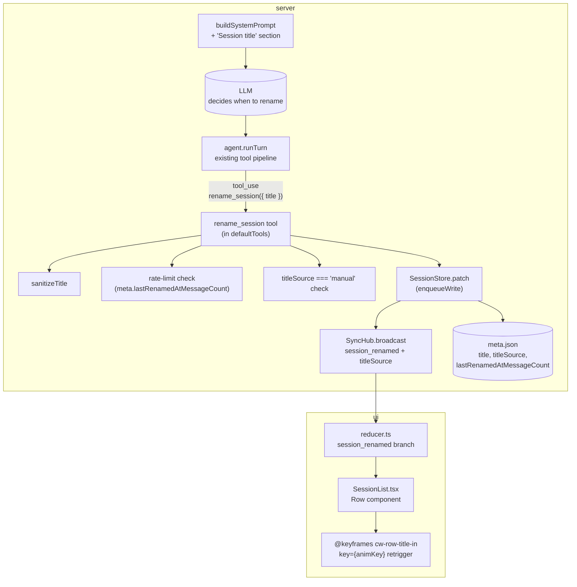

# Phase 19 — LLM-driven retitle: Design

## Architecture overview

This phase deletes the T12.2 fire-and-forget first-turn title
generator and replaces it with a single in-loop tool call. The
LLM drives the decision (when to rename); the server enforces
guard rails (rate limit, manual-rename lock, sanitization,
broadcast).



The hook point is the existing tool pipeline — no new agent-loop
plumbing, no new SSE event type, no changes to `core` or `agent`
packages. The tool's `execute` closes over the `SessionStore`
and `SyncHub` (passed at construction time, same pattern as the
memory tools).

## Tech stack

Unchanged. Bun + TypeScript (server, agent, core), React + Vite
(UI), Zod (schemas). No new deps.

## Module / package layout

### Server (`packages/server/src/`)

- `tools/rename-session.ts` (new) — defines the `rename_session`
  tool. Exposes `createRenameSessionTool(opts)` factory and a
  `sanitizeTitle` helper (moved from the deleted
  `title-generator.ts`).
- `tools/index.ts` — wires the new tool into `defaultTools`. The
  factory signature gains `store`, `syncHub`, and
  `minMessagesBetweenRenames`; `defaultTools` gains a new
  optional `config` parameter (or takes the relevant fields
  individually). Existing tests updated for the new signature.
- `tools/rename-session.test.ts` (new) — unit tests for the tool:
  happy path, rate limit, manual-rename lock, sanitization,
  empty-after-sanitize, session-not-found. Each rejection path
  is a separate test.
- `session-store.ts` — `SessionMetaSchema` gains
  `titleSource: z.enum(["auto", "manual"]).default("auto")` and
  `lastRenamedAtMessageCount: z.number().int().min(0).optional()`.
  `SessionPatchSchema` gains matching optional fields.
  `patchUnlocked` merges the new fields alongside `title` and
  `allowlist` (preserves the existing `enqueueWrite` race-safety).
- `session-store.test.ts` — round-trip tests for the new fields
  (parse-without-defaults, patch sets them, explicit patch wins).
- `routes/sessions.ts` (PATCH handler) — when the patch contains
  a `title` and no `titleSource`, stamp `titleSource: "manual"`.
  When `title: ""`, reset `titleSource: "auto"`.
- `routes/sessions.ts` (POST handler) — when the body contains a
  `title`, stamp `titleSource: "manual"`.
- `routes/sessions.test.ts` — round-trip tests for the
  manual/auto stamping.
- `routes/messages.ts` — DELETE the `void generateTitle(...)`
  call at the end of `runAgentForSession`. The tool pipeline
  replaces it. Delete the `generateTitle` import.
- `system-prompt.ts` — add the "Session title" section to
  `STATIC_PREFIX` (gated on `config.title.llmDecides`).
- `config.ts` — `ConfigSchema.title` gains
  `llmDecides: z.boolean().default(true)` and
  `minMessagesBetweenRenames: z.number().int().min(0).default(3)`.
  `applyEnvOverrides` honors
  `COMPUTERWORKS_TITLE_LLM_DECIDES` and
  `COMPUTERWORKS_TITLE_MIN_MESSAGES_BETWEEN_RENAMES`.
- `config.test.ts` — defaults, file overrides, env wins, invalid
  env falls back.
- `sse.ts` — `session_renamed` event gains optional `titleSource`
  field. Forward-compatible.

### `packages/server/src/title-generator.ts` — DELETED

- File and its test (if any) removed.
- The `sanitizeTitle` helper moves to
  `packages/server/src/tools/rename-session.ts`.
- The `extractFirstExchange` helper is also removed (only the
  first-turn generator used it).

### Agent (`packages/agent/src/`)

No changes. The agent loop already routes tool calls through the
registry and writes `tool_result` back as a message. The
`rename_session` tool is just another entry in the registry.

### Core (`packages/core/src/`)

No changes. `ToolDefinition` is unchanged. The new tool is a
`ToolDefinition` like every other tool.

### UI (`packages/ui/src/`)

- `api/types.ts` — `SessionMeta` (UI mirror) gains optional
  `titleSource: "auto" | "manual"`. `ServerEvent`'s
  `session_renamed` variant gains optional `titleSource`.
- `store/reducer.ts` — `session_renamed` case updates BOTH
  `title` and `titleSource` (defaulting missing field to
  `"auto"`) on the matching session in `state.sessions[]`.
- `store/reducer.test.ts` — pin the new `session_renamed`
  shape with and without `titleSource`.
- `components/SessionList.tsx` — `Row` watches `props.title` and
  `props.animated`. Bump `animKey` on SSE-driven changes.
  `SessionList` passes `animated={true` for SSE-driven renames
  and `animated={false` for the local rename input flow.
- `components/SessionList.test.tsx` (new) — mount/update/cold-
  start tests for the key retrigger.
- `styles/global.css` — add `@keyframes cw-row-title-in` and
  the matching `.cw-row-title` rule.

## Data model

### `SessionMeta`

```ts
export const SessionMetaSchema = z.object({
  id: z.string().min(1),
  title: z.string().default(""),
  titleSource: z.enum(["auto", "manual"]).default("auto"),
  lastRenamedAtMessageCount: z.number().int().min(0).optional(),
  createdAt: z.string(),
  updatedAt: z.string(),
  cwd: z.string(),
  model: z.string(),
  provider: z.string().default("anthropic"),
  allowlist: z.array(z.string()).default([]),
  systemPromptOverrides: z.string().optional(),
  memoryRoot: z.string().optional(),
});
```

Forward-compatible: old `meta.json` files without the new fields
default to `titleSource: "auto"` and `lastRenamedAtMessageCount:
undefined`.

### `SessionPatch`

```ts
export const SessionPatchSchema = z.object({
  title: z.string().min(1).optional(),
  titleSource: z.enum(["auto", "manual"]).optional(),
  lastRenamedAtMessageCount: z.number().int().min(0).optional(),
  cwd: z.string().min(1).optional(),
  model: z.string().min(1).optional(),
  allowlist: z.array(allowlistEntry).optional(),
  systemPromptOverrides: z.string().optional(),
}).strict();
```

The route stamps `titleSource: "manual"` when a patch sets
`title`; resets to `"auto"` when `title: ""`. Clients that
explicitly set `titleSource` win (escape hatch).

### `session_renamed` SSE event

```ts
type ServerEvent =
  | {
      type: "session_renamed";
      sessionId: string;
      title: string;
      titleSource?: "auto" | "manual";
    };
```

Forward-compatible: the new field is optional. Old clients ignore
it; new clients use it to gate the animation.

## API surface

### `PATCH /api/sessions/:id`

No public schema change. The route stamps `titleSource` when the
patch sets `title` and no explicit `titleSource` is provided.

### `POST /api/sessions`

No public schema change. The route stamps `titleSource: "manual"`
when the body includes a `title`.

### `POST /api/sessions/:id/messages`

No route change. The model calls `rename_session` as part of its
turn; the tool pipeline handles it. The fire-and-forget
`generateTitle` call is gone.

## Key algorithms

### `rename_session` tool

```ts
export interface RenameSessionToolOptions {
  store: SessionStore;
  syncHub: SyncHub;
  minMessagesBetweenRenames: number;
}

export function createRenameSessionTool(
  opts: RenameSessionToolOptions,
): ToolDefinition {
  return {
    name: "rename_session",
    description: "Update the session title ...",
    inputSchema: renameSessionInputSchema as unknown as ToolDefinition["inputSchema"],
    requiresApproval: false,
    async execute(input, ctx) {
      return await runRename(opts, input, ctx);
    },
  };
}

async function runRename(
  opts: RenameSessionToolOptions,
  input: { title: string },
  ctx: ToolContext,
): Promise<RenameResult> {
  const meta = await opts.store.get(ctx.sessionId);
  if (!meta) return { ok: false, reason: "session_not_found" };
  if (meta.titleSource === "manual") {
    return { ok: false, reason: "manual_rename_locked" };
  }

  // Count user messages in the persisted transcript.
  let userCount = 0;
  for await (const m of opts.store.readMessages(ctx.sessionId)) {
    if (m.role === "user") userCount++;
  }

  // Server-side rate limit. The first rename (last === undefined)
  // is always allowed.
  const last = meta.lastRenamedAtMessageCount;
  if (last !== undefined) {
    if (userCount - last < opts.minMessagesBetweenRenames) {
      return { ok: false, reason: "rate_limited" };
    }
  }

  const sanitized = sanitizeTitle(input.title);
  if (sanitized === "") {
    return { ok: false, reason: "empty_after_sanitize" };
  }

  // Patch meta + broadcast. The patch is atomic (tmp + rename)
  // and serialized via enqueueWrite since T18.
  await opts.store.patch(ctx.sessionId, {
    title: sanitized,
    titleSource: "auto",
    lastRenamedAtMessageCount: userCount,
  });
  opts.syncHub.broadcast({
    type: "session_renamed",
    sessionId: ctx.sessionId,
    title: sanitized,
    titleSource: "auto",
  });

  return { ok: true, title: sanitized };
}
```

The tool is registered alongside the other auto-approved tools
(`read_memory`, `list_memory`, `search_memory`). The agent loop
auto-approves it because `requiresApproval: false`. The result is
written back as a `tool_result` message — the model can read it
and adjust on the next turn.

### `sanitizeTitle` (moved from `title-generator.ts`)

```ts
export function sanitizeTitle(raw: string): string {
  // ... unchanged from T12.2
}
```

Pure. Exported from `tools/rename-session.ts`. Same unit tests as
the T12.2 version (just relocated).

### PATCH handler stamping

```ts
// In routes/sessions.ts PATCH handler.
if (parsed.data.title !== undefined && parsed.data.titleSource === undefined) {
  parsed.data.titleSource = parsed.data.title === "" ? "auto" : "manual";
}
```

The route infers `titleSource` from the title value. Clients that
explicitly set `titleSource` win.

### Sidebar animation

```tsx
function Row(props: RowProps) {
  const [animKey, setAnimKey] = useState(0);
  const prevTitle = useRef(props.title);

  useEffect(() => {
    if (prevTitle.current !== props.title && props.animated) {
      setAnimKey((k) => k + 1);
    }
    prevTitle.current = props.title;
  }, [props.title, props.animated]);

  return (
    <li ...>
      <span key={animKey} className="cw-row-title">
        {props.title || "(untitled)"}
      </span>
      ...
    </li>
  );
}
```

The parent (`SessionList`) passes `animated={true` when the
session's update came from a `session_renamed` SSE event, and
`animated={false` for the local rename input. The first render
after mount sees `prevTitle.current === props.title`, so the
animation does NOT fire on cold start.

## State management

No new server state beyond the two `SessionMeta` fields. The
tool's `execute` reads + patches the meta; the persisted file is
the source of truth across restarts.

The UI's only new state is the per-row `animKey` (local to the
`Row` component).

## Error handling

- **Tool execution fails** (e.g. patch fails) → the agent loop
  catches the throw, writes a `tool_result` with `is_error: true`
  and the message back to the conversation. The model sees the
  failure on the next turn and can react. The audit log gets an
  `approve_once` entry with `isError: true` — consistent with
  how other tool failures are recorded.
- **Manual rename race** — a user PATCHes `title` between the
  tool's `meta.titleSource` check and the patch. The patch
  arrives at `SessionStore.patch` and is serialized via
  `enqueueWrite`. If the user's PATCH lands first, the
  subsequent tool patch sets `titleSource: "auto"` and
  `lastRenamedAtMessageCount` — overwriting the user's manual
  flag. The race window is sub-second. Acceptable: the
  `session_renamed` SSE event broadcast the tool just made is
  immediately superseded by the user's PATCH, which the user
  can re-do if needed.
- **Sanitization yields empty string** → tool returns
  `empty_after_sanitize`. Model sees the rejection and tries a
  different title.
- **`llmDecides: false`** → the system-prompt section is
  omitted; the model never learns about the tool. The tool
  itself stays in the registry (so a model that happens to know
  the name can still call it, e.g. via a future override or
  manual prompt), but the system-prompt omission is the
  documented disable path.

## Testing strategy

Per CLAUDE.md §2, integration tests first. Tests added:

### Server unit (`tools/rename-session.test.ts`)

- **Happy path:** the tool is called with `{ title: "K8s
  migration" }`; meta has `titleSource: "auto"`, no prior
  rename. Asserts: meta is patched with `title: "K8s migration"`,
  `titleSource: "auto"`, `lastRenamedAtMessageCount: <user
  count>`. `SyncHub` receives a `session_renamed` event with
  the title and `titleSource: "auto"`. Tool returns
  `{ ok: true, title: "K8s migration" }`.
- **Rate limit:** meta has `lastRenamedAtMessageCount: 1` and
  the transcript has 3 user messages.
  `minMessagesBetweenRenames: 3` → `userCount - last = 2 < 3`
  → tool returns `{ ok: false, reason: "rate_limited" }`. Meta
  is NOT patched. No broadcast.
- **Rate limit (boundary):** `lastRenamedAtMessageCount: 1`,
  `userCount: 4`, `min: 3` → `userCount - last = 3 >= 3` → tool
  succeeds. Meta is patched with `lastRenamedAtMessageCount: 4`.
- **Rate limit (first rename):** `lastRenamedAtMessageCount`
  is `undefined`. Any `userCount > 0` succeeds. (The first
  rename is always allowed.)
- **Manual-rename lock:** `meta.titleSource === "manual"`. Tool
  returns `{ ok: false, reason: "manual_rename_locked" }`. Meta
  is NOT patched.
- **Empty after sanitize:** `input.title = "   !!!   "`.
  Sanitizer yields `""`. Tool returns
  `{ ok: false, reason: "empty_after_sanitize" }`.
- **Quoted title:** `input.title = '"K8s migration"'`.
  Sanitizer yields `K8s migration`. Tool succeeds, meta is
  patched with the unquoted title.
- **Long title:** `input.title` is 500 chars. Sanitizer
  truncates to 80 chars at a word boundary. Tool succeeds with
  the truncated title.
- **Session not found:** `store.get` returns `null`. Tool
  returns `{ ok: false, reason: "session_not_found" }`. No
  patch, no broadcast.

### Server unit (`session-store.test.ts`)

- Parse a `meta.json` without `titleSource` → default `"auto"`.
- Parse without `lastRenamedAtMessageCount` → `undefined`.
- `patch({ title: "X" })` updates `titleSource: "manual"`.
- `patch({ title: "" })` updates `titleSource: "auto"`.
- `patch({ title: "X", titleSource: "auto" })` honors the
  explicit value.
- `patch({ lastRenamedAtMessageCount: 4 })` updates that field
  only.

### Server integration (`routes/sessions.test.ts`)

- `PATCH /api/sessions/:id` with `{ title: "X" }` returns the
  patched meta with `titleSource: "manual"`.
- `PATCH /api/sessions/:id` with `{ title: "" }` returns
  `titleSource: "auto"`.
- `POST /api/sessions` with `{ title: "X" }` creates the meta
  with `titleSource: "manual"`.

### Server integration (`routes/messages.test.ts`)

- Scripted provider that calls `rename_session({ title: "X" })`
  on its first turn. After the turn, `meta.title === "X"`,
  `meta.titleSource === "auto"`,
  `meta.lastRenamedAtMessageCount === 1`. The `session_renamed`
  SSE event fires with `titleSource: "auto"`.
- Scripted provider that calls `rename_session` twice in a
  row. The second call gets `rate_limited` as the tool result
  (with `minMessagesBetweenRenames: 3`).
- A user PATCH between scripted turns locks the session; the
  next `rename_session` call gets `manual_rename_locked`.
- The T12.2 first-turn generator is gone — no
  `void generateTitle(...)` call. Verified by grepping
  `routes/messages.ts` for `generateTitle` (zero matches).

### Server unit (`config.test.ts`)

- Default config has `title.llmDecides: true` and
  `title.minMessagesBetweenRenames: 3`.
- File config overrides the defaults.
- `COMPUTERWORKS_TITLE_LLM_DECIDES=false` flips the flag.
- `COMPUTERWORKS_TITLE_MIN_MESSAGES_BETWEEN_RENAMES=5` overrides
  the number.
- Invalid env values fall back to the schema defaults.

### Server unit (`system-prompt.test.ts` — new or extended)

- Default config: the rendered system prompt contains
  `"## Session title"` and the `rename_session` paragraph.
- `llmDecides: false`: the rendered system prompt does NOT
  contain `"## Session title"`.

### UI (`SessionList.test.tsx` — new)

- Mount the `Row` with `title="foo"` and `animated={true}` →
  the rendered `<span>` has `key="0"`.
- Update `title` to `"bar"` → after the effect, `key` is `"1"`.
- Mount with `title="foo"`, then update to `"foo"` (no change)
  → `key` stays at `"0"`.
- Update with `animated={false` → `key` stays at `"0"`.

### UI (`reducer.test.ts`)

- `session_renamed` with `titleSource: "manual"` updates BOTH
  `title` and `titleSource` on the matching session.
- `session_renamed` without `titleSource` (legacy client)
  defaults `titleSource` to `"auto"`.

## Deployment / runtime

No changes. Same Fastify server, same single-port build, same UI
bundle. The UI bundle gains a few hundred bytes for the
`@keyframes cw-row-title-in` rule and the `animKey` state. The
system prompt grows by ~250 tokens.

The `title-generator.ts` file is deleted; no on-disk migration
needed (the file is build-time, not runtime).

## Security & privacy

- The `rename_session` tool input is LLM-controlled. The
  server's `sanitizeTitle` is the same defensive function the
  T12.2 generator used; it strips quotes, prefixes, control
  characters, and truncates.
- The rate limit is a soft backstop against a model that tries
  to rename every turn. The structured `rate_limited` result
  is the only "feedback" the model gets; no UI prompt, no
  security boundary.
- The `titleSource` field is metadata about provenance, not
  content. No privacy implications.
- The new env overrides don't accept credentials; they're
  boolean / numeric only.

## Risks & mitigations

| Risk | Mitigation |
|---|---|
| Model ignores the system prompt and renames every turn | Server-side rate limit caps at 1 rename per `minMessagesBetweenRenames` (default 3) user messages. Model gets `rate_limited` feedback. |
| Model calls the tool with a hostile input (e.g. 1MB title, code injection) | `sanitizeTitle` truncates to 80 chars, strips control characters, no eval / regex injection surface. |
| User PATCH race with a tool rename | Both go through `SessionStore.patch` (serialized via `enqueueWrite`). The race window is sub-second. Worst case: a manual rename is briefly overwritten; the user re-PATCHes. |
| Old titled sessions become eligible for the LLM-driven retitler | Backward-compat default is `titleSource: "auto"`. Operators who want a sticky title rename once via the UI. |
| Model never calls the tool (e.g. small model, system prompt ignored) | User can rename manually. No regression vs. today — the T12.2 first-turn generator is gone, so a model that ignores the prompt gives a session with no title. This is the trade-off for "LLM-driven". |
| System prompt grows by ~250 tokens | One-time cost per turn. Negligible. |

## Implementation order

1. **Server: `rename_session` tool + `sanitizeTitle` move.**
   `tools/rename-session.ts` (new) + `tools/rename-session.test.ts`
   (new). Unit tests for every branch.
2. **Server: `SessionMeta` fields + `SessionStore.patch`**
   round-trip. `session-store.ts` + `session-store.test.ts`.
3. **Server: PATCH/POST stamp `titleSource`.** `routes/sessions.ts`
   + `routes/sessions.test.ts`. Round-trip tests.
4. **Server: `config.title` + env overrides.** `config.ts` +
   `config.test.ts`.
5. **Server: `system-prompt.ts` "Session title" section, gated
   on `llmDecides`.** Test the gate.
6. **Server: `routes/messages.ts` — delete the
   `void generateTitle(...)` call. Delete `title-generator.ts`.**
   Verify the messages route no longer imports `generateTitle`.
7. **Server: `session_renamed` SSE event gains `titleSource`.**
   `sse.ts` + the integration test in `routes/messages.test.ts`.
8. **UI: `SessionMeta.titleSource` + reducer round-trip.**
   `api/types.ts` + `reducer.ts` + `reducer.test.ts`.
9. **UI: `Row` animation, `SessionList` passes `animated`.** New
   test file.
10. **CSS: `@keyframes cw-row-title-in` + `.cw-row-title`.**
11. **Docs, smoke, ship.** Update `CLAUDE.md` Phase status, mark
    the spec done.

Each step lands behind `bun run typecheck && bun test`.